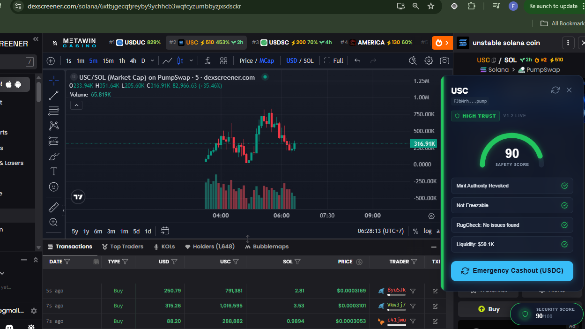
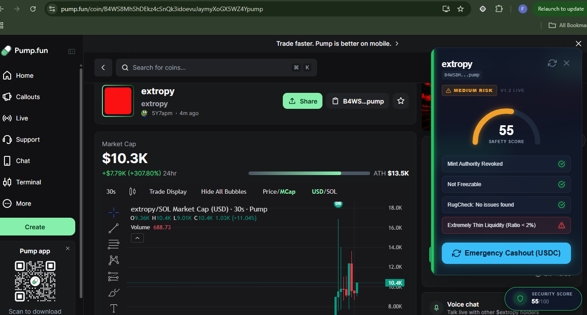

# Rugsentry
> **The Ultimate Real-time Security Shield for Solana Traders**


## 📖 Overview
Rugsentry is a high-performance, context-aware Chrome extension built specifically for the Solana ecosystem. It acts as an automated security auditor right in your browser, shielding traders from the most common and devastating DeFi vectors: **Rugpulls, Honeypots, and Illiquid Traps**. 

By injecting real-time risk assessments directly into popular DEX interfaces like DexScreener, Birdeye, and Pump.fun, Rugsentry ensures that users can make informed, lightning-fast trading decisions without having to manually verify contract safety.


## 🏗️ Core Architecture (The Dual-Engine)
Rugsentry employs a robust, multi-layered security engine that aggregates data from industry-leading APIs in real-time to generate a comprehensive 0-100 Trust Score:

| Layer | Provider | Purpose |
| :--- | :--- | :--- |
| **Contract Audit** | [GoPlus Security](https://gopluslabs.io/) | Detects fatal flags such as Mint Authority and Freeze Authority statuses, as well as Top 10 Holder Sybil/Cluster concentration. |
| **Holder & LP Analysis** | [RugCheck API](https://rugcheck.xyz/) | Analyzes liquidity locks, developer token holding percentages, and LP provider diversity. |
| **Market Context** | [DexScreener API](https://dexscreener.com/) | Evaluates liquidity depth, liquidity-to-market-cap ratios (Liquidity Traps), and extreme price action (Massive Dumps). |

### 📸 Previews
| DexScreener Integration | Pump.fun Integration |
| :---: | :---: |
|  |  |

*Visual overview of Rugsentry real-time risk assessment.*

## 🚀 Key Technical Features
Our engineering philosophy focuses on zero-latency UX and absolute data integrity:

- **Graceful Degradation (`AbortController`)**: External APIs (like GoPlus) can sometimes experience severe latency or network congestion. Rugsentry uses a strict 8-second `fetchWithTimeout` wrapper. If an API times out or fails (500 Internal Server Error), the extension gracefully degrades, skipping the failed layer while continuing to calculate the score using the remaining APIs.
- **Race Condition Protection (`useRef`)**: In modern Single Page Applications (SPAs) where users rapidly switch between token pages, API promises can resolve out-of-order. Rugsentry utilizes a unique `scanIdRef` to discard stale data and prevent "UI overwriting," ensuring the displayed score always matches the current URL.
- **Client-Side Caching (TTL Logic)**: To prevent rate-limiting from public APIs and drastically improve performance, Rugsentry utilizes `@plasmohq/storage` to cache risk reports locally. The cache is enforced with a strict 5-minute Time-To-Live (TTL).
- **Null-safe Scoring Algorithm**: A rigorous, purely mathematical scoring engine that guarantees the final score is strictly clamped between `0` and `100`, heavily fortified against `Division by Zero` traps and `NaN` propagation from malformed API responses.

## 🛠️ Tech Stack
- **Framework**: [Plasmo](https://docs.plasmo.com/) (The Browser Extension Framework)
- **UI & Styling**: React 18, Tailwind CSS v3
- **Language**: TypeScript
- **State & Storage**: React Hooks (`useState`, `useRef`), `@plasmohq/storage`
- **Testing**: Vitest

## 💻 Development

### Prerequisites
Make sure you have [Node.js](https://nodejs.org/) installed on your machine.

### Getting Started

1. Clone the repository:
```bash
git clone https://github.com/KevinFalah/rugsentry-extension.git
cd rugsentry-extension
```

2. Install dependencies:
```bash
npm install
```

3. Run the development server:
```bash
npm run dev
```

4. Load the extension in Chrome:
   - Open Chrome and navigate to `chrome://extensions/`
   - Enable **Developer mode** (top right corner)
   - Click **Load unpacked** and select the `build/chrome-mv3-dev` folder generated by the build process.

## 📄 License
MIT License - See [LICENSE](LICENSE) for details.
